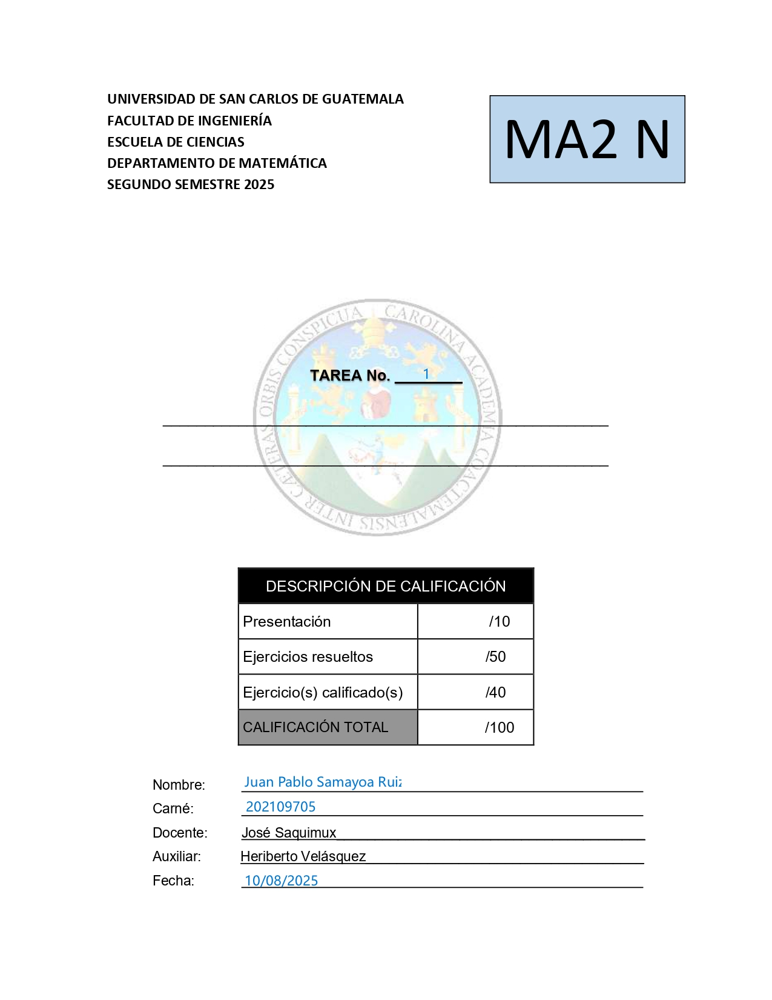
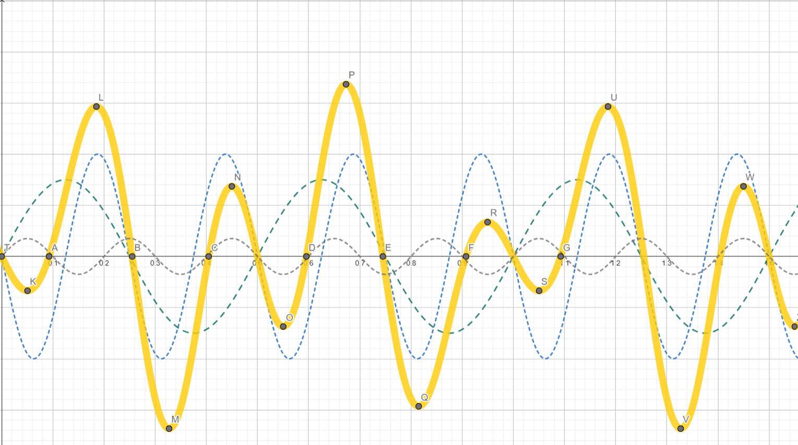
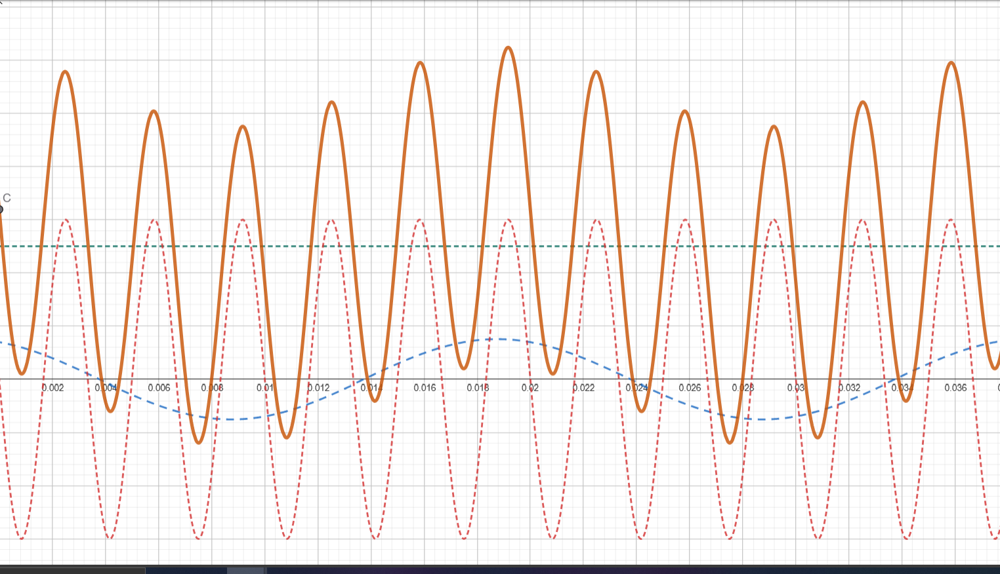
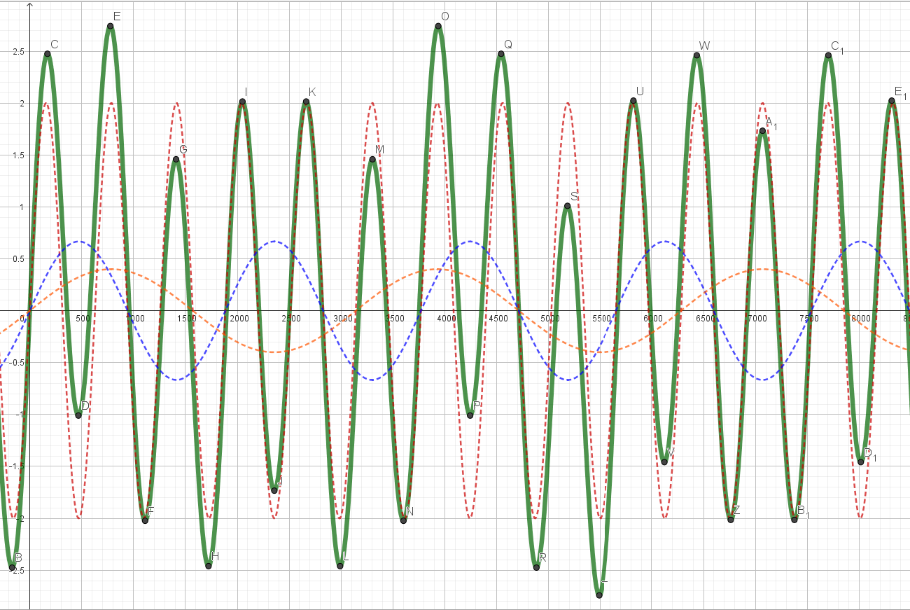
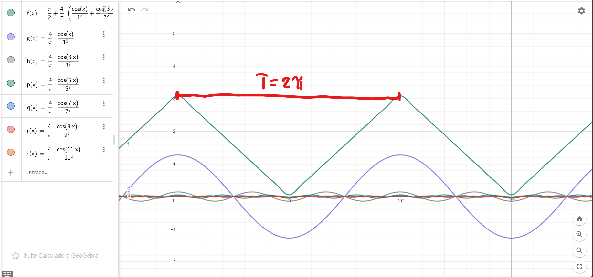
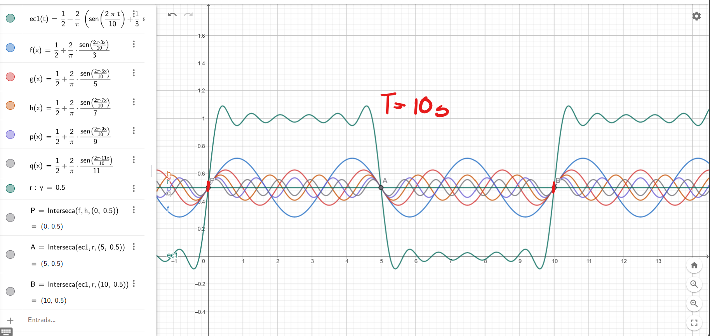
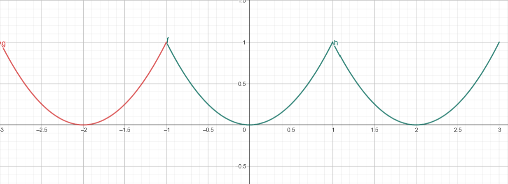
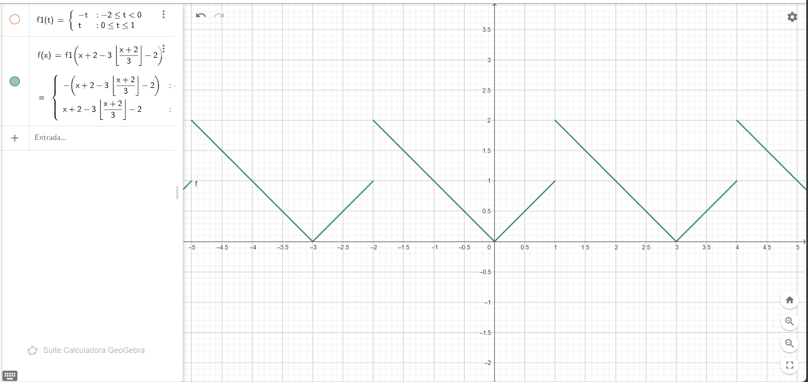

### ------------------------------Ejercicio 1_a|Pagina 1|#1------------------------------

a) **$f(t) = 3\sin 2\pi \cdot 2 \cdot t - 4\sin 2\pi \cdot 4 \cdot t + 0.7\sin2\pi \cdot 5 \cdot t$**

* **$frecuencia (f) = 1$**
* **$Periodo (T) = 1$**
* No presenta componente fundamental

|                          | $3sen2\pi\cdot 2\cdot t$   | $-4\sin2\pi\cdot 4\cdot t$   | $0.7\sin 2\pi \cdot5\cdot t $|
|--------------------------|:--------------------------:|:----------------------------:|:----------------------------:|
|Amplitud                  |3 amps                      |4 amps                        | 0.7 amps                     |
|Periodo                   |$\frac{1}{2}seg$            |$\frac{1}{4}seg$              |$\frac{1}{5}seg$              |
|F.Lineal                  |2 Hz                        |4Hz                           |5Hz                           |
|F.Angular                 |$4\pi \frac{rad}{seg}$      |$8\pi \frac{rad}{seg}$        |$10\pi \frac{rad}{seg}$       |
|Angulo de Fase            |0                           |0                             |0                             |
|Armonicas presentes       |Segunda Armonica            |Cuarta Armonica               |Quinta Armonica               |

### ------------------------------Ejercicio 1_b|Pagina 1|#2------------------------------
b) $f(t) = 5 + \frac{3}{2}\cos(2\pi \cdot 50 \cdot t + \pi/8) + 6\cos(2\pi \cdot 300 \cdot t + \pi/2)$

* **$frecuencia (f) = 50$**
* **$Periodo (T) = \frac{1}{50}$**
* **$Componente fundamental = \frac{3}{2}cos(2\cdot\pi\cdot 50\cdot t + \frac{\pi}{8})$**

|                          | $\frac{3}{2}\cos(2\pi \cdot 50 \cdot t + \pi/8)$   | $6\cos(2\pi \cdot 300 \cdot t + \pi/2)$   |
|--------------------------|:--------------------------:|:----------------------------:|
|Amplitud                  |$\frac{3}{2}$ amps          |6 amps                        |
|Periodo                   |$\frac{1}{50}seg$           |$\frac{1}{300}seg$            |
|F.Lineal                  |50 Hz                       |300Hz                         |
|F.Angular                 |$100\pi \frac{rad}{seg}$    |$600\pi \frac{rad}{seg}$      |
|Angulo de Fase            |$\frac{\pi}{8}rad$          |$\frac{\pi}{2}rad$            |
|Armonicas presentes       |Componente fundamental      |Sexta Armonica                |

### ------------------------------Ejercicio 1_c|Pagina 1|#3------------------------------
c) $f(t) = 2\sin(\frac{t}{100})+\frac{2}{3}\sin(\frac{t}{300})+\frac{2}{5}\sin(\frac{t}{500})$

$f(t) = 2\sin(\frac{2\pi t}{200\pi})+\frac{2}{3}\sin(\frac{2\pi t}{600\pi})+\frac{2}{5}\sin(\frac{2\pi t}{1000\pi})$

* **$frecuencia (f) = \frac{1}{50}$**
* **$Periodo (T) = 3000\pi$**
* **$Componente fundamental = 2\sin(\frac{2\pi t}{200\pi})$**

|                          | $2\sin(\frac{2\pi t}{200\pi})$   | $\frac{2}{3}\sin(\frac{2\pi t}{600\pi})$   | $\frac{2}{5}\sin(\frac{2\pi t}{1000\pi}) $|
|--------------------------|:--------------------------:|:----------------------------:|:----------------------------:|
|Amplitud                  |2 amps                      |$\frac{2}{3}amps$             | $\frac{2}{5}$ amps           |
|Periodo                   |$200\pi seg$                |$600\pi seg$                  |$1000\pi seg$                 |
|F.Lineal                  |$\frac{1}{200\pi}$ Hz       |$\frac{1}{600\pi}$ Hz         |$\frac{1}{1000\pi}$ Hz          |
|F.Angular                 |$\frac{1}{100} \frac{rad}{seg}$      |$\frac{1}{300} \frac{rad}{seg}$        |$\frac{1}{500} \frac{rad}{seg}$       |
|Angulo de Fase            |0                           |0                             |0                             |
|Armonicas presentes       |Componente fundamental      |Quinta Armonica               |Tercera Armonica              |

### ------------------------------Ejercicio 2|Pagina 1|#4------------------------------

Determine el periodo de la serie

$x(t) = \frac{\pi}{2} + \frac{4}{\pi} (\frac{\cos x}{1^2} + \frac{\cos 3x}{3^2} + \frac{\cos 5x}{5^2})$

Y grafique la señal recortada hasta con 6 terminos y cada uno de las armónicas

* Reescribir las serie cómo:

$x(t) = \frac{\pi}{2} + \frac{4}{\pi} (\frac{\cos \frac{2\pi t}{2\pi}}{1^2} + \frac{\cos \frac{2\pi 3t}{2\pi}}{3^2} + \frac{\cos \frac{2\pi 5t}{2\pi}}{5^2})$

### ------------------------------Ejercicio 3|Pagina 1|#5------------------------------

Determine el periodo de la serie

$x(t) = \frac{1}{2} + \frac{2}{\pi}\sin \frac{\pi t}{5} + \frac{2}{\pi 3}\sin \frac{3\pi t}{5} + \frac{2}{5\pi}\sin \frac{5\pi t}{5} + \frac{2}{7\pi}\sin \frac{7\pi t}{5}$

Y grafique la señal recortada hasta con 6 términos y cada una de las armonicas

$x(t) = \frac{1}{2} + \frac{2}{\pi}(\sin \frac{2\pi t}{10} + \frac{1}{3}\sin \frac{2\pi 3t}{10} + \frac{1}{5}\sin \frac{2\pi 5t}{10} + \frac{1}{7}\sin \frac{2\pi 7t}{10}+\frac{1}{9}\sin \frac{2\pi 9t}{10} + \frac{1}{11}\sin \frac{2\pi 11t}{10})$

### ------------------------------Ejercicio 4_a|Pagina 1|#6------------------------------

Exprese la función dada como una suma de funciones seno, determine su amplitud y ángulo de fase de cada armónica. (Apoyese de formulas trigonométricas, vea el formulario de trigonometría)

a) $f(x) = 0.5\cos t + 3.2\sin t$

**$A\sin(wt + \phi) = a\cos t(wt) + b\sin(wt)$**

* $A = \sqrt{a^2+b^2} = \sqrt{0.5^2+3.2^2} = 3.24$
* $\phi = \tan^{-1}(\frac{a}{b}) = \tan^{-1}(\frac{0.5}{3.2}) = 0.155$

**$3.24\sin(t+0.155)$**

### ------------------------------Ejercicio 4_b|Pagina 1|#7------------------------------

Exprese la función dada como una suma de funciones seno, determine su amplitud y ángulo de fase de cada armónica. (Apoyese de formulas trigonométricas, vea el formulario de trigonometría)

b) $x(t) = 3\cos 3t$

* $\cos =  \sin(\phi + \frac{\pi}{2}) $

**$ 3\sin(3t + \frac{\pi}{2}) $**

### ------------------------------Ejercicio 5_a|Pagina 1|#8------------------------------

Para las siguientes funciones periódicas, trace las gráficas de al menos tres períodos:

a) $ f(t) = t^2, -1 \leq t \leq 1 $

### ------------------------------Ejercicio 5_b|Pagina 1|#9------------------------------

Para las siguientes funciones periódicas, trace las gráficas de al menos tres períodos:

b) 
$$f(t) = \begin{cases} 
-t & -2 \leq t < 0 \\
t & 0 \leq t \leq 1
\end{cases}$$

### ------------------------------Ejercicio 5_b|Pagina 2|#9------------------------------