

## Formas de Onda Periódicas
### ------------------------------Ejercicio 1_a|Pagina 1|#1------------------------------

a) **$f(t) = 3\sin 2\pi \cdot 2 \cdot t - 4\sin 2\pi \cdot 4 \cdot t + 0.7\sin2\pi \cdot 5 \cdot t$**

* **$frecuencia (f) = 1$**
* **$Periodo (T) = 1$**
* No presenta componente fundamental

|                          | $3sen2\pi\cdot 2\cdot t$   | $-4\sin2\pi\cdot 4\cdot t$   | $0.7\sin 2\pi \cdot5\cdot t $|
|--------------------------|:--------------------------:|:----------------------------:|:----------------------------:|
|Amplitud                  |3 amps                      |4 amps                        | 0.7 amps                     |
|Periodo                   |$\frac{1}{2}seg$            |$\frac{1}{4}seg$              |$\frac{1}{5}seg$              |
|F.Lineal                  |2 Hz                        |4Hz                           |5Hz                           |
|F.Angular                 |$4\pi \frac{rad}{seg}$      |$8\pi \frac{rad}{seg}$        |$10\pi \frac{rad}{seg}$       |
|Angulo de Fase            |0                           |0                             |0                             |
|Armonicas presentes       |Segunda Armonica            |Cuarta Armonica               |Quinta Armonica               |

### ------------------------------Ejercicio 1_b|Pagina 1|#2------------------------------

b) $f(t) = 5 + \frac{3}{2}\cos(2\pi \cdot 50 \cdot t + \pi/8) + 6\cos(2\pi \cdot 300 \cdot t + \pi/2)$

* **$frecuencia (f) = 50$**
* **$Periodo (T) = \frac{1}{50}$**
* **$Componente fundamental = \frac{3}{2}cos(2\cdot\pi\cdot 50\cdot t + \frac{\pi}{8})$**

|                          | $\frac{3}{2}\cos(2\pi \cdot 50 \cdot t + \pi/8)$   | $6\cos(2\pi \cdot 300 \cdot t + \pi/2)$   |
|--------------------------|:--------------------------:|:----------------------------:|
|Amplitud                  |$\frac{3}{2}$ amps          |6 amps                        |
|Periodo                   |$\frac{1}{50}seg$           |$\frac{1}{300}seg$            |
|F.Lineal                  |50 Hz                       |300Hz                         |
|F.Angular                 |$100\pi \frac{rad}{seg}$    |$600\pi \frac{rad}{seg}$      |
|Angulo de Fase            |$\frac{\pi}{8}rad$          |$\frac{\pi}{2}rad$            |
|Armonicas presentes       |Componente fundamental      |Sexta Armonica                |

### ------------------------------Ejercicio 1_c|Pagina 1|#3------------------------------

c) $f(t) = 2\sin(\frac{t}{100})+\frac{2}{3}\sin(\frac{t}{300})+\frac{2}{5}\sin(\frac{t}{500})$

$f(t) = 2\sin(\frac{2\pi t}{200\pi})+\frac{2}{3}\sin(\frac{2\pi t}{600\pi})+\frac{2}{5}\sin(\frac{2\pi t}{1000\pi})$

* **$frecuencia (f) = \frac{1}{50}$**
* **$Periodo (T) = 3000\pi$**
* **$Componente fundamental = 2\sin(\frac{2\pi t}{200\pi})$**

|                          | $2\sin(\frac{2\pi t}{200\pi})$   | $\frac{2}{3}\sin(\frac{2\pi t}{600\pi})$   | $\frac{2}{5}\sin(\frac{2\pi t}{1000\pi}) $|
|--------------------------|:--------------------------:|:----------------------------:|:----------------------------:|
|Amplitud                  |2 amps                      |$\frac{2}{3}amps$             | $\frac{2}{5}$ amps           |
|Periodo                   |$200\pi seg$                |$600\pi seg$                  |$1000\pi seg$                 |
|F.Lineal                  |$\frac{1}{200\pi}$ Hz       |$\frac{1}{600\pi}$ Hz         |$\frac{1}{1000\pi}$ Hz          |
|F.Angular                 |$\frac{1}{100} \frac{rad}{seg}$      |$\frac{1}{300} \frac{rad}{seg}$        |$\frac{1}{500} \frac{rad}{seg}$       |
|Angulo de Fase            |0                           |0                             |0                             |
|Armonicas presentes       |Componente fundamental      |Quinta Armonica               |Tercera Armonica              |

### ------------------------------Ejercicio 2|Pagina 1|#4------------------------------

Determine el periodo de la serie

$x(t) = \frac{\pi}{2} + \frac{4}{\pi} (\frac{\cos x}{1^2} + \frac{\cos 3x}{3^2} + \frac{\cos 5x}{5^2})$

Y grafique la señal recortada hasta con 6 terminos y cada uno de las armónicas

* Reescribir las serie cómo:

$x(t) = \frac{\pi}{2} + \frac{4}{\pi} (\frac{\cos \frac{2\pi t}{2\pi}}{1^2} + \frac{\cos \frac{2\pi 3t}{2\pi}}{3^2} + \frac{\cos \frac{2\pi 5t}{2\pi}}{5^2})$

### ------------------------------Ejercicio 3|Pagina 1|#5------------------------------

Determine el periodo de la serie

$x(t) = \frac{1}{2} + \frac{2}{\pi}\sin \frac{\pi t}{5} + \frac{2}{\pi 3}\sin \frac{3\pi t}{5} + \frac{2}{5\pi}\sin \frac{5\pi t}{5} + \frac{2}{7\pi}\sin \frac{7\pi t}{5}$

Y grafique la señal recortada hasta con 6 términos y cada una de las armonicas

$x(t) = \frac{1}{2} + \frac{2}{\pi}(\sin \frac{2\pi t}{10} + \frac{1}{3}\sin \frac{2\pi 3t}{10} + \frac{1}{5}\sin \frac{2\pi 5t}{10} + \frac{1}{7}\sin \frac{2\pi 7t}{10}+\frac{1}{9}\sin \frac{2\pi 9t}{10} + \frac{1}{11}\sin \frac{2\pi 11t}{10})$

### ------------------------------Ejercicio 4_a|Pagina 1|#6------------------------------

Exprese la función dada como una suma de funciones seno, determine su amplitud y ángulo de fase de cada armónica. (Apoyese de formulas trigonométricas, vea el formulario de trigonometría)

a) $f(x) = 0.5\cos t + 3.2\sin t$

**$A\sin(wt + \phi) = a\cos t(wt) + b\sin(wt)$**

* $A = \sqrt{a^2+b^2} = \sqrt{0.5^2+3.2^2} = 3.24$
* $\phi = \tan^{-1}(\frac{a}{b}) = \tan^{-1}(\frac{0.5}{3.2}) = 0.155$

Respuesta:
**$3.24\sin(t+0.155)$**

### ------------------------------Ejercicio 4_b|Pagina 1|#7------------------------------

Exprese la función dada como una suma de funciones seno, determine su amplitud y ángulo de fase de cada armónica. (Apoyese de formulas trigonométricas, vea el formulario de trigonometría)

b) $x(t) = 3\cos 3t$

* $\cos =  \sin(\phi + \frac{\pi}{2}) $

Respuesta:

**$ 3\sin(3t + \frac{\pi}{2}) $**

### ------------------------------Ejercicio 5_a|Pagina 1|#8------------------------------

Para las siguientes funciones periódicas, trace las gráficas de al menos tres períodos:

a) $ f(t) = t^2, -1 \leq t \leq 1 $

### ------------------------------Ejercicio 5_b|Pagina 1|#9------------------------------

Para las siguientes funciones periódicas, trace las gráficas de al menos tres períodos:

b) 
$$f(t) = \begin{cases} 
-t & -2 \leq t < 0 \\
t & 0 \leq t \leq 1
\end{cases}$$

### ------------------------------Ejercicio 6_a|Pagina 2|#10------------------------------

Escriba expresiones matemáticas para describir las funciones cuyas gráficas se muestran a continuación

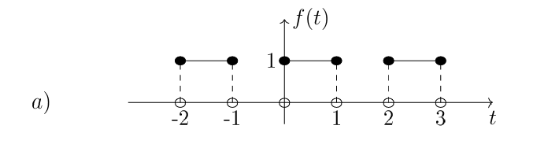

Respuesta:

$$f(t) = \begin{cases} 
1 & 0 \leq t < 1 \\
0 & -1 \leq t \leq 0
\end{cases}$$

$T = 2$ 

### ------------------------------Ejercicio 6_b|Pagina 2|#11------------------------------

Escriba expresiones matemáticas para describir las funciones cuyas gráficas se muestran a continuación

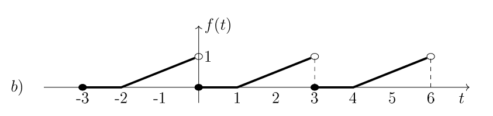

Respuesta:

$$f(t) = \begin{cases} 
0 & 0 \leq t < 1 \\
\frac{1}{2}t -\frac{1}{2} & 1 \leq t \leq 3
\end{cases}$$

$T = 3$ 

## Funciones Pares e impares
### ------------------------------Ejercicio 1_a|Pagina 2|#12------------------------------

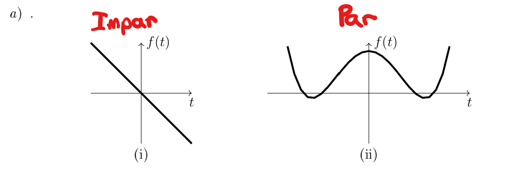

* i (Impar): Presenta simetria respecto al origen
* ii (Par): Presenta simpretia respecto al eje vertical

### ------------------------------Ejercicio 1_b|Pagina 2|#13------------------------------

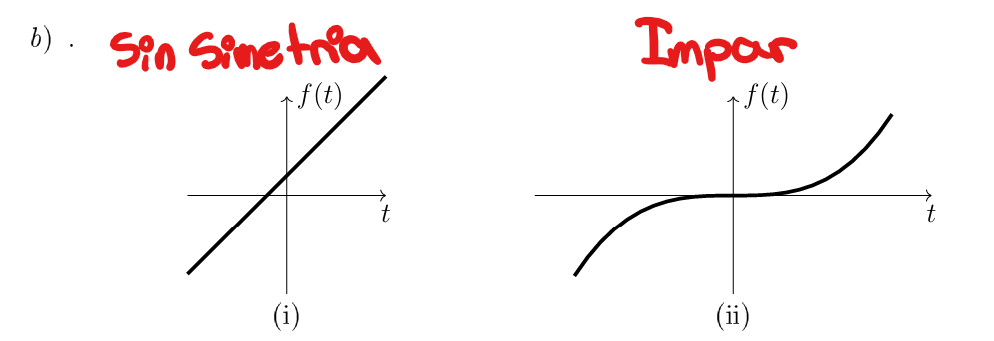

* i: La gráfica no presenta simetría ni respecto al eje vertical ni respecto al origen.
* ii: La gráfica cumple la condición de función impar. Esto significa que si se rota la gráfica 180° alrededor del origen, coincide consigo misma.

### ------------------------------Ejercicio 1_c|Pagina 3|#14------------------------------

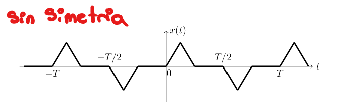

* No es simétrica porque no cumple ninguna de las simetrías típicas: par, impar ni de media onda. Y al desplazar medio período, la mitad derecha no es la negación exacta de la izquierda, por lo que tampoco hay simetría de media onda.

### ------------------------------Ejercicio 1_d|Pagina 3|#15------------------------------

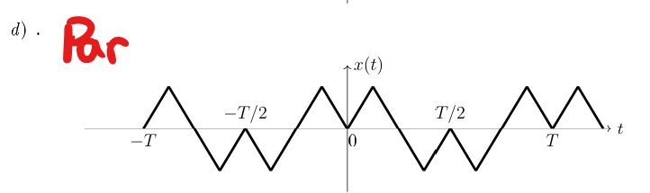

* Visualmente, el trazo a la izquierda de 0 es el espejo exacto del de la derecha: el valle está en 𝑡 = 0 t=0 y los picos aparecen a distancias iguales ±T/2 con la misma altura. 

### ------------------------------Ejercicio 1_e|Pagina 3|#16------------------------------

$ f(x) = \sin t - 0.5t^2$

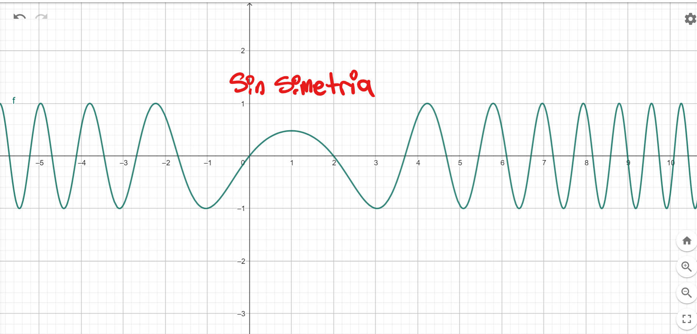

* No hay simetria debido a que la función es una mezcla de de una parte impar y otra que es par, el termino $-0.5t^2$ rompe con la simetria periódica.

### ------------------------------Ejercicio 2|Pagina 3|#17------------------------------

Usando las propiedades de funciones pares e impares, establezca si las siguientes funciones son pares o impares o ninguna.

* $t^3\sin wt$: Tanto $t^3$ como $\sin wt$ son impares, por lo tanto la multiplicación de ambos da como resultado una **funcion par**

* $t \cos t$: El termino $t$ es par, el termino $\cos t$ es un termino par, el resultado de la multiplicación de ambos da como resultado una **función impar**

* $\cos wt \sin wt$: $\cos wt$ es un termino par, sin embargo $\sin wt$ es un termino impar, por lo que el resultado de la multiplicación de ambas da como resultado una **función impar**

* $x(t) = |t| +1, -2<t<2, T=4$:

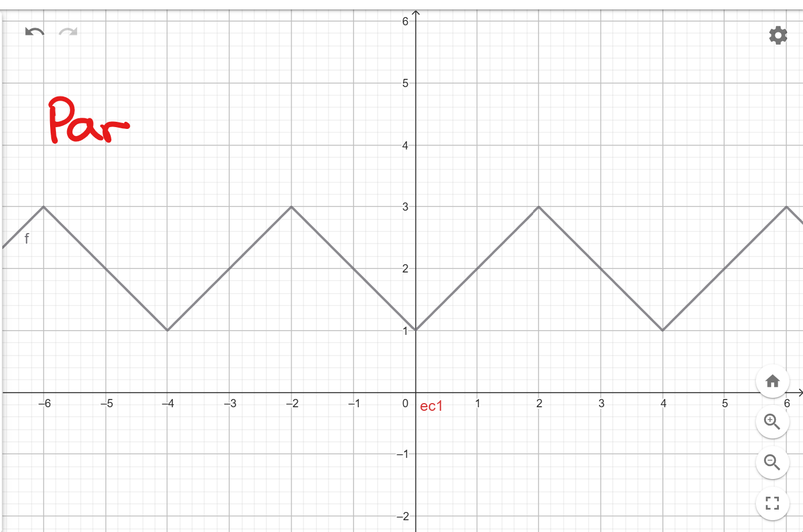

### ------------------------------Ejercicio 3|Pagina 3|#18------------------------------

Evalue las siguientes integrales usando las propiedades de integrales para funciones pares o impares donde sea necesario

* $\int_{-5}^{5} t^3 dt$: **función impar**
* $\int_{-\pi}^{\pi} t^3 \sin t dt$: **función par**
* $\int_{-1}^{1} t^3 \cos 3t dt$: **función impar**
* $\int_{-T}^{T} \sin(nwt) \cos(mwt) dt$ **función impar**

## Ortogonalidad e identidades de integrales
### ------------------------------Ejercicio 1|Pagina 3|#19------------------------------

Usando la identidad triconométrica $2\cos A \cos B = \cos(A+B) + \cos(A-B)$, compruebe la integral dada. Graficando el integrando con $m = 2, n=3 , w=1$ en $\pi \leq t \leq \pi$. Justifique su valor nulo en términos de area neta

$\int_{\frac{-\pi}{w}}^{\frac{\pi}{w}} \cos mwt \cos nwt \, dt = \begin{cases} 
0 & m \neq n \\
\frac{\pi}{w} & m = n \neq 0
\end{cases}$

* $\cos 2t \dot \cos 3t$
* $0.5\cos (2t + 3t) + 0.5\cos(3t-2t)$
* Respuesta: $\int_{-\pi}^{\pi} 0.5 \cos(5t) + 0.5\cos(t) dt$

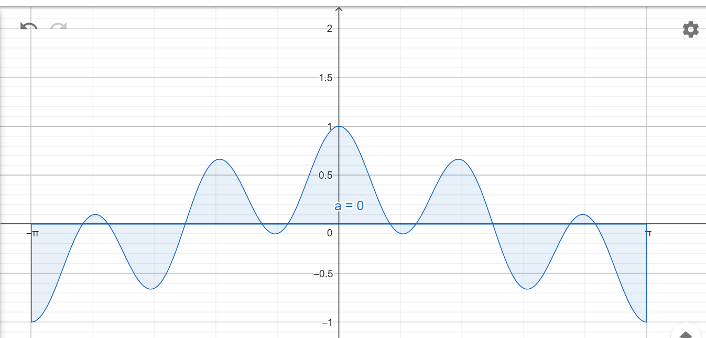

### ------------------------------Ejercicio 2|Pagina 3|#20------------------------------

$\int_{0}^{T} \cos \frac{2\pi mt}{T} \cos \frac{2\pi nt}{T}\, dt = \begin{cases} 
0 & m \neq n \\
\frac{T}{2} & m = n \neq 0
\end{cases}$

* $\cos \frac{2\pi 2t}{T} \cdot \cos \frac{2\pi 3t}{T}$
* $0.5\cos(\frac{2\pi (3t+2t)}{T}) + 0.5\cos(\frac{2\pi (3t-2t)}{T})$
* $\frac{1}{2} \int_{-\pi}^{\pi} \cos(5t)+\cos(t)\, dt$

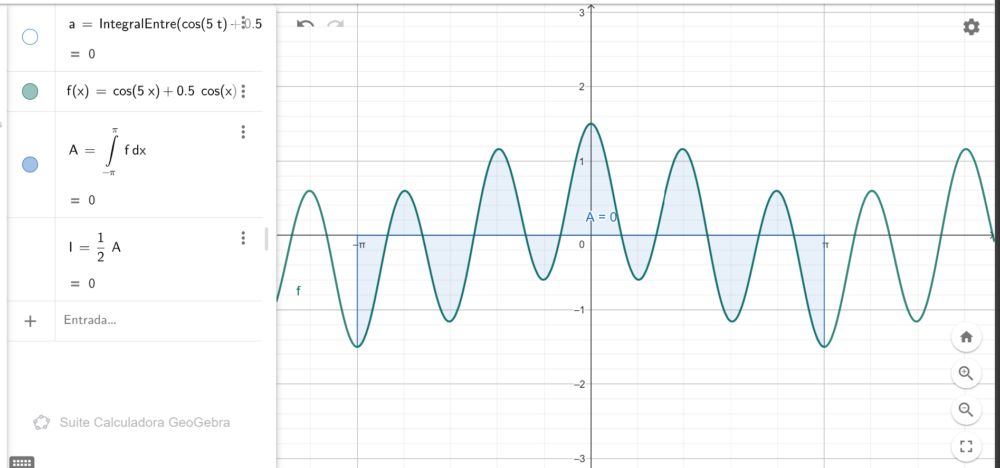

### ------------------------------Ejercicio 3|Pagina 3|#21------------------------------

$\int_{0}^{T} \cos \frac{2\pi mt}{T} \sin \frac{2\pi nt}{T}\, dt = $ para todo m y n

* $\cos \frac{2\pi 2t}{T} \cdot \sin \frac{2\pi 3t}{T}$
* $\frac{1}{2}[\sin(3t-2t)+\sin(2t+3t)]$
* $\frac{1}{2} \int_{-\pi}^{\pi} \sin(5t)+\sin(t)\, dt$

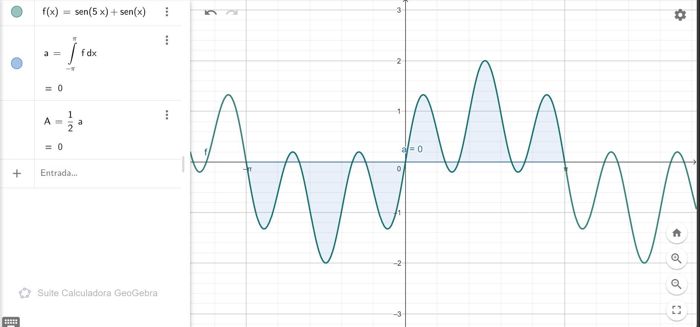

## Series trigonometricas de fourier
### ------------------------------Ejercicio 1|Pagina 3|#22------------------------------

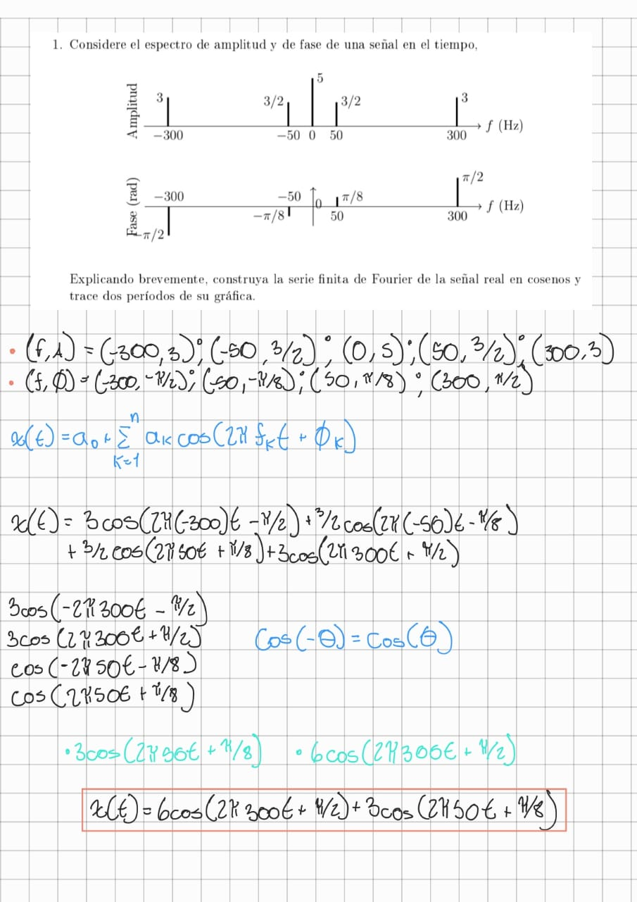

### ------------------------------Ejercicio 2|Pagina 3|#23------------------------------

Determine la representación de la serie de Fourier de la función y dibuje su espectro de amplitud

$$f(t) = \begin{cases} 
0 & -5 < t < 0 \\
1 & 0 < t < 5
\end{cases}$$

